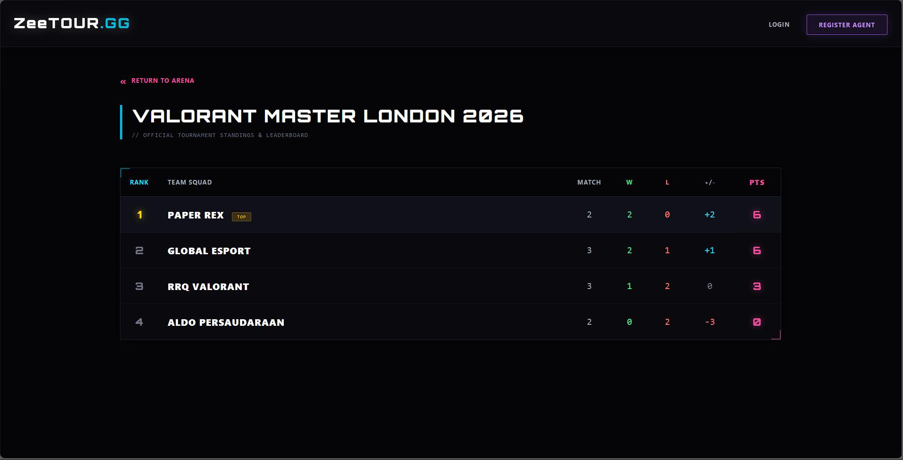
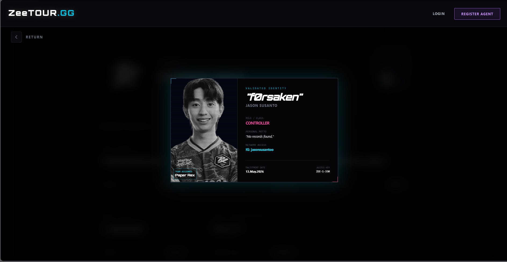
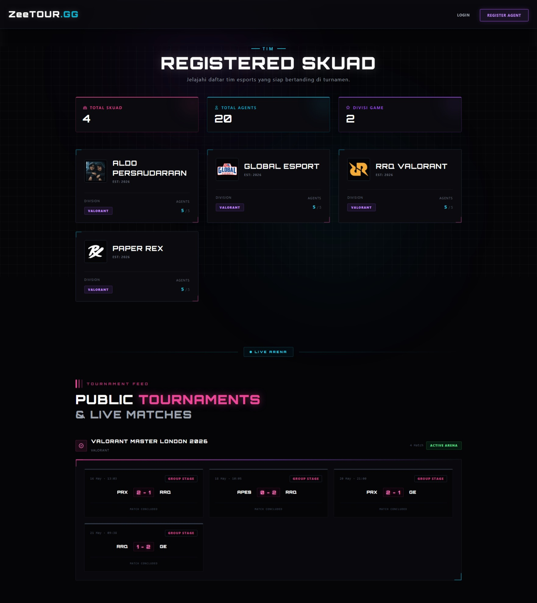
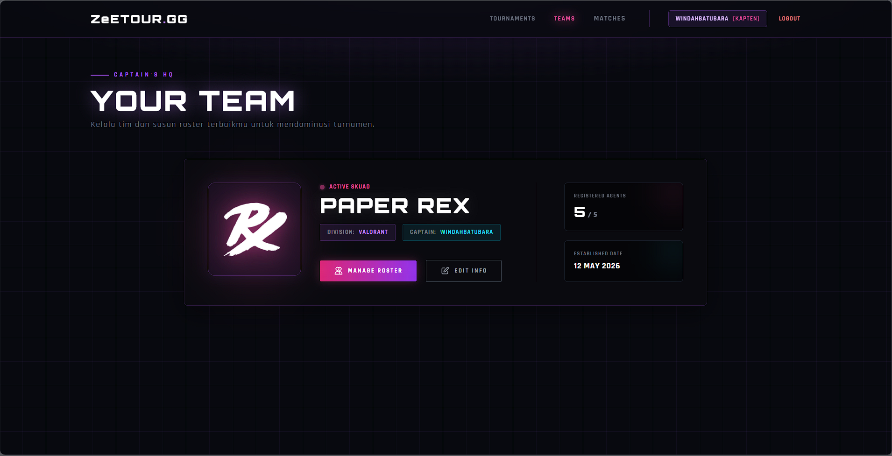
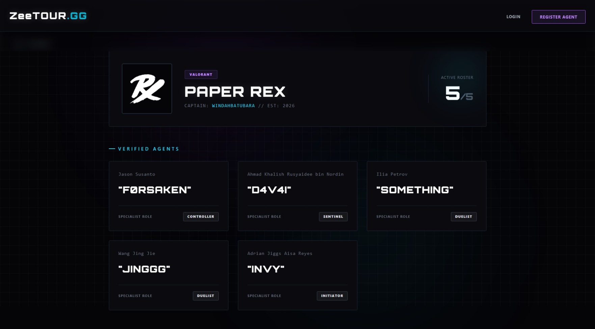
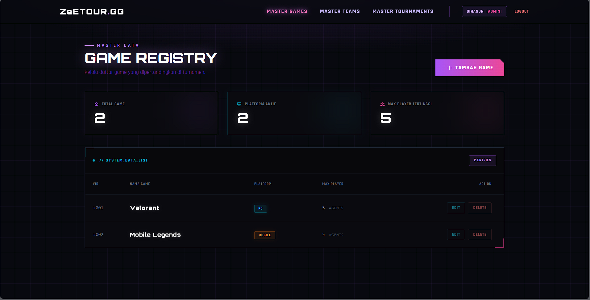
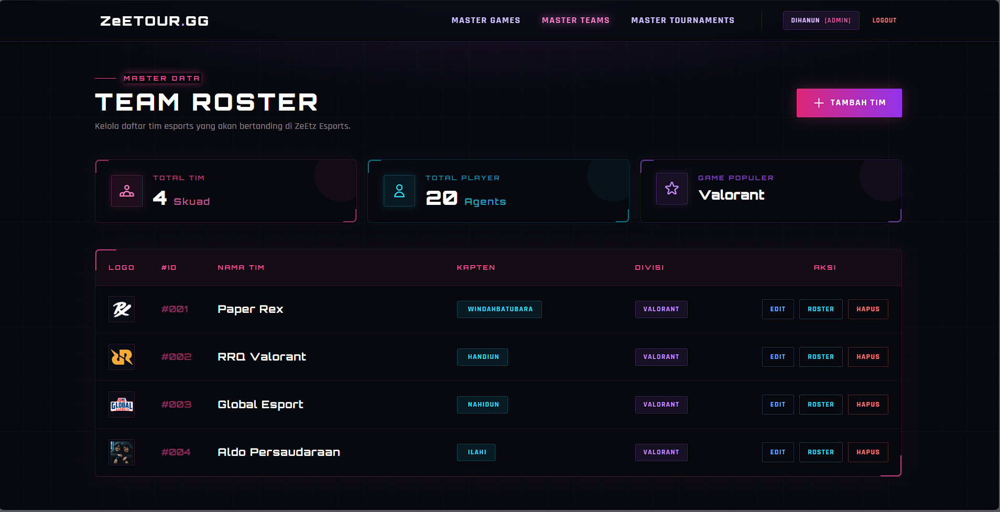
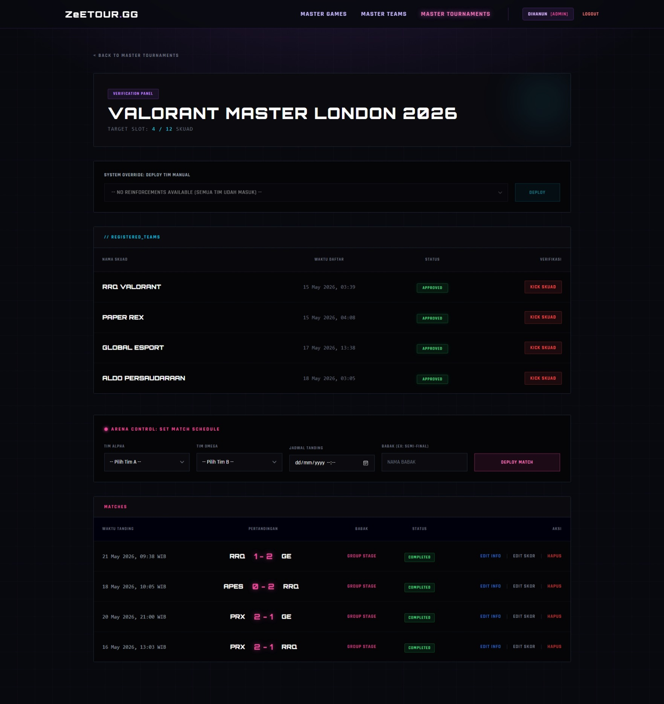

# ⚡ ZeETOUR.GG - Esports Tournament Management System

[](https://laravel.com)
[](https://php.net)
[](https://tailwindcss.com)

**ZeeTOUR.GG** adalah platform manajemen turnamen esports berbasis web yang dirancang khusus dengan tema UI/UX *Cyberpunk/Valorant Style*. Aplikasi ini dibangun menggunakan framework **Laravel 12** untuk mengatasi masalah manajemen turnamen amatir yang seringkali berantakan akibat kalkulasi manual.

---

## 📸 Preview Tampilan Aplikasi

Sistem ini dibagi menjadi tiga ekosistem utama: **Public View**, **Captain HQ**, dan **Admin Command Center**.

### 1. Core Logic & Public Features
Fitur utama yang dapat diakses publik, menonjolkan kalkulasi otomatis dan interaktivitas UI tingkat tinggi.

| Automated Leaderboard | Interactive Player ID Card |
|:---:|:---:|
|  |  |

<details>
  <summary><b>🔥 Tampilkan Full Capture Landing Page</b></summary>
  <br>
  
</details>

---

### 2. Captain HQ (User Dashboard) & Public Roster
Ruang kendali khusus bagi kapten tim untuk mengelola skuad dan mendaftarkan agen ke dalam turnamen.

| My Team Overview | Roster Management |
|:---:|:---:|
|  |  |

---

### 3. Admin Command Center
Panel kontrol eksklusif bagi administrator untuk mengatur *Master Data* ekosistem turnamen.

| Master Game Management | Master Team Verification |
|:---:|:---:|
|  |  |

<details>
  <summary><b>⚙️ Tampilkan Full Capture Master Tournament</b></summary>
  <br>
  
</details>

---

## 🚀 Fitur Unggulan (Backend Logic)

Aplikasi ini menerapkan logika pemrograman terstruktur:

1. **Automated Leaderboard & Tie-Breaker Algorithm:** Klasemen turnamen dihitung 100% otomatis secara *real-time* dari pertandingan (`Matches`) yang berstatus *Completed*. Menggunakan *Collection* Laravel untuk melakukan *sorting* bertingkat berdasarkan **Poin Tertinggi**, disusul oleh **Selisih Skor/Map Difference (+/-)** jika seri.
2. **Progressive Disclosure UI:** Menghemat ruang visual dengan menyembunyikan biodata lengkap pemain. Data intelijen agen akan di-render secara dinamis menggunakan mekanisme modal pop-up via JavaScript.
3. **Role-Based Access Control (RBAC):** Pemisahan otorisasi ketat antara **Admin** dan **Captain**.
4. **Secure File Handling:** Manajemen berkas gambar untuk Logo Tim dan Foto Agen menggunakan sistem `Storage Link` yang dilengkapi fitur *auto-delete* saat data diperbarui untuk menghemat *storage* server.

---

## 🛠️ Tech Stack & Libraries

- **Backend:** PHP 8.2 & Laravel 12.x
- **Frontend:** Tailwind CSS, Vanilla JavaScript, SweetAlert2
- **Database:** MySQL
- **Fonts:** Orbitron, Sans-serif & Rajdhani

---

## 💻 Cara Instalasi Lokal

1. **Clone Repository:**
   ```bash
   git clone [https://github.com/DihanSae29/ZeeTOUR.gg.git](https://github.com/DihanSae29/ZeeTOUR.gg.git)
   cd ZeeTOUR.gg